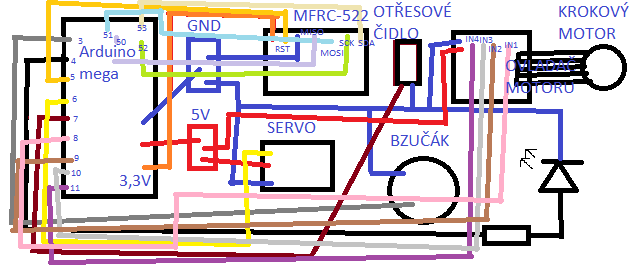
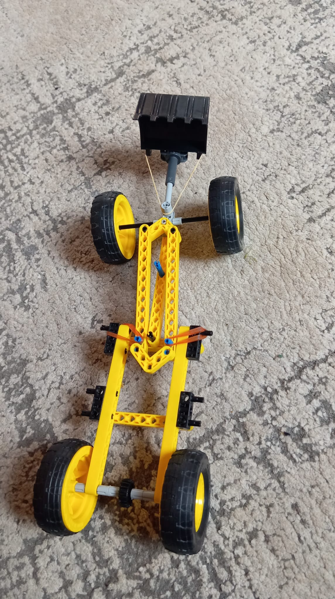
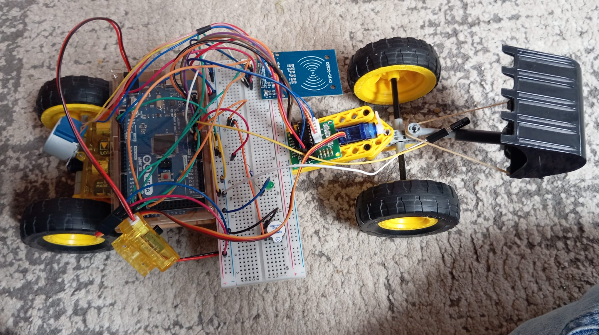
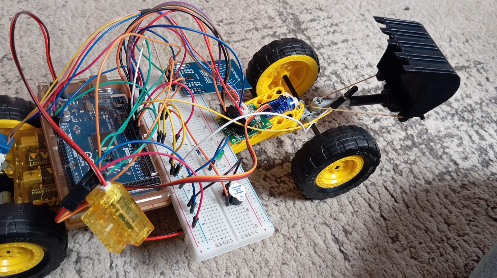

# Školní-projekt 2
__Dobrý den, Vypracoval: Adam Franc__  
 
1.[Druhé pololetí](#prvn%C3%AD-pololet%C3%AD-20122024) 
-1.1[Projekt](#projekt) 
--1.1.1[Fotky](#fotky) 
--1.1.2[Video](#video) 
--1.1.3[Popis](#popis) 
-1.2[Cíl projektu](#c%C3%ADl-projektu) 
-1.3[Můj pohled na projekt](#m%C5%AFj-pohled-na-projekt) 
3.[Zdroje](#zdroje) 
 
## Druhé pololetí 16.5.2025
V druhém pololetí jsem se rozhodl naučit se v programu Arduino IDE a rohodl jsem se sestavi robota simulujícího robotický vysavač až na to že nevysává.
### Projekt📁
Jako projekt jsem si vybral a vymyslel: __Robotický vysavač bez vysávání__ 
 
__Tady je program na arduino__
<pre>
<code id="code-block">
#include <SPI.h>
#include <MFRC522.h>
#include <Servo.h>
#include <Stepper.h>

#define SS_PIN 53
#define RST_PIN 5
MFRC522 mfrc522(SS_PIN, RST_PIN);

#define LED_PIN 4
#define BUZZER_PIN 3
#define SERVO_PIN 6
#define SHAKE_SENSOR_PIN 7

#define IN1 8
#define IN2 9
#define IN3 10
#define IN4 11
#define STEPS_PER_REV 2048  // pro 28BYJ-48

Servo myServo;
Stepper myStepper(STEPS_PER_REV, IN1, IN3, IN2, IN4);

unsigned long unlockTime = 0;
bool isUnlocked = false;
bool motorRunning = false;
const String authorizedUID = "E3 02 A9 FC"; // UID karty

void setup() {
  Serial.begin(9600);
  SPI.begin();
  mfrc522.PCD_Init();

  pinMode(LED_PIN, OUTPUT);
  pinMode(BUZZER_PIN, OUTPUT);
  pinMode(SHAKE_SENSOR_PIN, INPUT);

  myServo.attach(SERVO_PIN);
  myServo.write(0);

  myStepper.setSpeed(10);
  digitalWrite(LED_PIN, LOW);
  digitalWrite(BUZZER_PIN, LOW);

  Serial.println("Přilož RFID kartu...");
}

void loop() {
  // RFID čtečka
  if (mfrc522.PICC_IsNewCardPresent() && mfrc522.PICC_ReadCardSerial()) {
    String uidStr = "";
    for (byte i = 0; i < mfrc522.uid.size; i++) {
      if (mfrc522.uid.uidByte[i] < 0x10) uidStr += "0";
      uidStr += String(mfrc522.uid.uidByte[i], HEX);
      if (i < mfrc522.uid.size - 1) uidStr += " ";
    }

    uidStr.toUpperCase();
    Serial.print("UID karty: ");
    Serial.println(uidStr);

    if (uidStr == authorizedUID && !isUnlocked) {
      unlockSystem();
    }

    mfrc522.PICC_HaltA();
  }

  // Zamknout po 20 sekundách
  if (isUnlocked && millis() - unlockTime > 60000) {
    lockSystem();
  }

  // Když je odemčeno, toč motorem
  if (isUnlocked && motorRunning) {
    myStepper.step(10); // otáčení vpřed

    if (digitalRead(SHAKE_SENSOR_PIN) == HIGH) {
      Serial.println("Otřes detekován!");

      // Zastav motor
      motorRunning = false;

      // Bzučák a LED
      digitalWrite(BUZZER_PIN, HIGH);
      digitalWrite(LED_PIN, HIGH);
      delay(1000);
      digitalWrite(BUZZER_PIN, LOW);

      // Krokový motor dozadu
      myStepper.step(-1000);
      delay(1000);

      // Servo se otočí
      myServo.write(30);
      delay(1000);
      
      motorRunning = true;
    }
  }
}

void unlockSystem() {
  isUnlocked = true;
  unlockTime = millis();
  motorRunning = true;

  Serial.println("✅ SYSTÉM ODEMKNUT");
  digitalWrite(LED_PIN, HIGH);
}

void lockSystem() {
  isUnlocked = false;
  motorRunning = false;

  Serial.println("🔒 SYSTÉM ZAMKNUT");
  digitalWrite(LED_PIN, LOW);
  myServo.write(0);
}
</code>
<button onclick="copyToClipboard()">Můžete si kód klidně zkopírovat a zkusit.</button>
</pre>
#### Fotky📷
Zde je schéma __zapojení__.
 

 
Tady jsou fotky ze stavby a zapojení robota.
 

 

 

#### Video📽
Zde je stavba a programace mého díla.  
[Sledujte video na Google Drive](https://drive.google.com/file/d/1dde__meeCsf8Jv0vqH-MyN_2luJrceo_/view?usp=sharing)
[Sledujte video na Google Drive]([https://drive.google.com/file/d/1ypbqBTWg2mv9Rm_5_K_RhccYSWaEKLSi/view?usp=sharing](https://drive.google.com/file/d/1ypbqBTWg2mv9Rm_5_K_RhccYSWaEKLSi/view?usp=drive_link))
 

#### Popis📝
Za pomocí arduina a krokového motoru jsem nasimuloval jízdu vysavače. Takže když přiložíme kartu k vysavači robot se odemkne a bude minutu uklízet. Pokud ale narazí, couvne si, zmení směr a pojede dál.
 

### Cíl projektu🎯
Projektem jsem si chtěl zkusit sestavit model a nasimulovat princip robotických vysavačů a sekaček
 

### Můj pohled na projekt👌
Projekt jsem dělal hodně dlouho, protože jsem vždycky něco zkazil a trvalo mi dlouho než jsem na to přišel. Vyzkoušel jsem si jak zapojování tak i programování a dokonce jsem i pájel a přemněřoval výstupi a tiskl si ozubené kolečka na 3D tiskárně abych to zpřevodoval. 

## Zdroje
1) > používal jsem AI
2) > Především jsem ten projekt vymýšlel sám.
